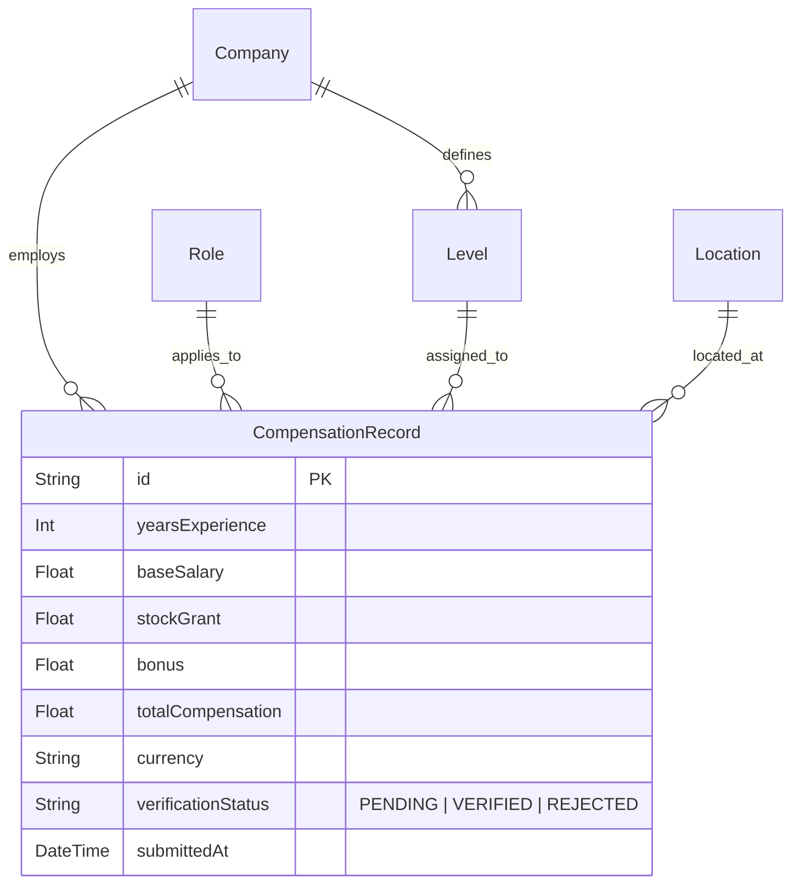

# CompLens — Developer Compensation Portal

CompLens is a unique, professional developer compensation portal (inspired by tools like Linear, Stripe, and Vercel) that standardizes and benchmarks engineering wages across major technology companies, roles, levels, and geographic tech hubs. 

It is built with a focus on **clean architecture, reliability, extensibility, and execution quality** rather than visual complexity.

---

## 🚀 Key Features

* **Data-First SaaS Dashboard**: Centered widgets displaying overall median total compensation, active reports count, and company representations.
* **Unified Search Zone**: Full-width search bar with focus ring highlights and glass dropdown capsules filtering by Experience, Level, and Location COL Tier.
* **Interactive Leaderboards**: Ranks top paying companies and roles with circular branding borders and **relative pay scale progress bars** comparing entries against the top market rate.
* **Standardized Level Mapping (Grade Equivalency)**: Maps distinct internal corporate levels (e.g., Google `L5`, Meta `E5`, Microsoft `63`) against standardized global career grades (`Entry`, `Mid`, `Senior`, `Staff`, `Principal`, `Director+`).
* **Card-Based Compensation listings**: Cards with vertical spacing that expand to show segmented charts (base salary, stock, and bonus ratios), employer ratings, and pros/cons tags.
* **Compensation Comparison Workspace**: A multi-parameter workspace where developers can run side-by-side total pay, base, stock, and bonus comparisons by company, role, and location.
* **Submission Moderation Queue**: A verification pipeline where submitted records enter a `PENDING` validation queue moderated securely via the `/admin` portal.

---

## 🛠️ Architecture & Technology Stack

* **Frontend**: Next.js 15+ (App Router), React, TypeScript.
* **Styling**: Tailwind CSS v4 (incorporating glassmorphism variables, Royal Indigo/Blue branding, and Emerald Green comp indicators).
* **Database & ORM**: Prisma Client querying a relational database.
* **Charts & Analytics**: Recharts and Lucide React.
* **Authentication**: Next.js Server Actions with custom session management and hashed credentials.

---

## ⚙️ Backend Architecture & Service Layer

* **Typesafe Server Actions**: All mutations, creation parameters, and session validations are executed securely inside Next.js Server Actions (`src/actions/auth.actions.ts` and `src/actions/compensation.actions.ts`), ensuring complete server-side isolation.
* **Business Logic Layer**: Core services are isolated under `src/services/` to keep controllers clean:
  - **Comparison Service (`ComparisonService`)**: Handles statistical querying, percentile calculation, and location arbitrage indexing.
  - **Equivalency Service (`EquivalencyService`)**: Handles standard career grade parsing and mapping algorithms.
* **Crypto Security**: Uses standard password hashing for secure authentication storage.
* **Moderation Queue**: Dynamic verification state machine where salary submissions require admin validation. Integrates `revalidatePath` to trigger live server cache updates upon status transitions.

---

## 📐 System & Database Design

The relational database schema is structured to ensure maximum extensibility:



### Dual-Path Level Mapping
To scale easily, the system resolves levels via two paths:
1. **Disclosed Mapping Path**: Uses strict internal level selections for companies with public, well-defined compensation structures.
2. **Estimated Mapping Path (Heuristics Engine)**: For start-ups or companies without public frameworks, developers submit a standard designation (e.g. *Senior Software Engineer*). The `EquivalencyService` automatically infers the equivalent standardized grade and writes it as an estimated entry with a calculated confidence score.

---

## 📊 Comparison Workflows & Formulas

### 1. Cost of Living Geo-Arbitrage (Buying Power Adjusted Score)
Standardizes salaries across disparate regional cost-of-living metrics:
$$\text{Adjusted Buying-Power Score} = \left(\frac{\text{Total Compensation (INR)}}{\text{Cost of Living Index}}\right) \times 100$$
Allows developers to quickly identify locations offering higher disposable income relative to local expenses.

### 2. Relative Pay Scale Premium
Ranks and displays the comparative salary premium relative to the global market average:
$$\text{Market Premium} = \left(\frac{\text{Local Median} - \text{National Average}}{\text{National Average}}\right) \times 100$$

---

## 💻 Running Locally

### 1. Requirements
Ensure you have **Node.js** and **npm** installed on your system.

### 2. Ingest Dependencies
```bash
npm install
```

### 3. Database Sync & Seed
```bash
npx prisma db push
npx prisma db seed
```

### 4. Development Server
```bash
npm run dev
```
Open [http://localhost:3000](http://localhost:3000) inside your web browser.

### 5. Verify Build & Types
```bash
# Verify TypeScript type-safety
npx tsc --noEmit

# Verify optimized production build compile
npm run build
```

---

## 🎨 Development Principles

* **Extensibility**: Adding new companies, roles, locations, or levels requires zero codebase changes. Simply insert rows in the database, and the UI maps them dynamically.
* **Clean Code**: Keeps components single-purpose. Separate business logic layers (like `ComparisonService` or `EquivalencyService`) are isolated from React views.
* **Reliability**: Fully verified against strict static compilation checks and production bundle builds, ensuring zero hydration warnings or route issues.
